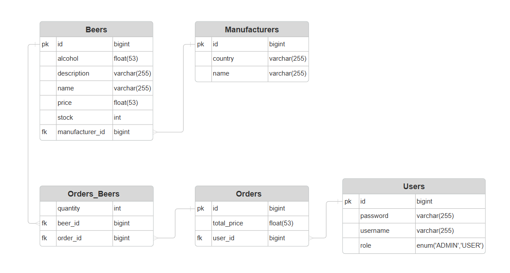

# beer-store-goloviatinski

## Description
Backend de magasin de bières implémenté en Spring Boot dans le cadre du cours 3291.2 JEE/Spring I.

Des collections Postman ont été incluses pour faciliter le test des routes.

## Cachier des charges
### Fonctionnalités
* En tant qu'**utilisateur** je veux pouvoir consulter le catalogue des bières, leurs prix et les stock restants

* En tant qu'**utilisateur** je veux pouvoir créer un panier pour une commande contenant des bières, et m'indiquant les éléments commandés et le prix total

* En tant qu'**administrateur** je veux pouvoir créer des fabricants, des bières liées ainsi que définir le stock et le prix

## Installation

    mvn clean install
    mvn spring-boot:run

## Architecture
Voici le schéma relationnel de la base de données:


Les champs additionnels des bières ont été ajoutés en s'inspirant de bases de données existantes comme [openbeer](https://openbeer.github.io/).

Pour ce qui est de l'architecture de l'application, chaque entité a son repository, service et controller correspondant, à l'exception de OrderBeerEntity qui permet juste de règler la relation N-N entre les bières et les commandes. 

La première entité a être implémentée a été celle des bières, suivi par celle des fabricants. Ensuite l'entité des commandes et finalement celle des utilisateurs.

Bien que pas exigé dans le cahier des charges, Spring Security a été implémenté car cela semblait comme la façon la plus simple pour pouvoir gérer l'accès aux routes par type d'utilisateur. Cela a aussi permis de pouvoir mettre les mots de passe des utilisateur en hash dans la base de données. La gestion des routes avec Spring Security est géré par 3 classes différentes: CommandLineAppStartupRunner, CustomUserDetailsService et SecurityConfig.

* SecurityConfig contient la configuration des routes ainsi que le type d'encodage utilisé pour les mots de passe.

* CustomUserDetailsService permet de récupérer un UserDetails pour Spring Security. Comme ça, si un nouveau utilisateur est créé on va pouvoir l'utiliser pour se connecter aux routes accessibles seulement par eux.

* CommandLineAppStartupRunner va mettre un utilisateur admin de base dans la base de données. En soi ceci n'est pas forcément nécessaire vu que Spring Security crée déjà un utilisateur admin par défaut mais cela permet de visualiser ça dans la base de données directement et faire d'autres manipulations sur celui-ci.

Il est possible d'avoir un peu plus de détails sur les routes ainsi que les entités en allant sur le lien suivant après avoir démarré l'application:
http://localhost:8080/swagger-ui/index.html

Voici cependant un vue d'ensemble des routes et des restrictions appliquées sur celles-ci:
* Un visiteur peut voir le catalogue des bières et fabricants ainsi que créer un utilisateur (/beer, /beer{id}, /manufacturer, /manufacturer{id}, /user)
* Seul un utilisateur peut créer des commandes. Il ne peut gérer que ses propres commandes et pas ceux des autres. Idem pour son compte. (/order/** et /user/**)
* L'administrateur a accès à toutes les routes et c'est notamment lui qui va pouvoir gérer les bières et fabricants
* Toutes les autres routes nécessitent par défaut une authentification (à part /h2/** et /swagger-ui/** dans le contexte de ce projet)

Le choix de faire en sorte que chaque entité ait son propre repository, service et controller a été fait pour laisser l'application flexible. Ceci s'est d'ailleurs avéré utile le plus des entités ont été ajoutés et modifiés, notamment celle des utilisateurs après l'ajout de Spring Security.

## Problèmes et résolutions
### Contenu JSON récursif en liant 2 entités ensemble.
En reliant deux entités ensemble et en en créant dans la base de données, il était possible d'avoir une inclusion récursif où par exemple une bière avait un fabricant et le fabricant avait plusieurs bières, donnant un JSON récursif. Ceci a pu être règlé en ajoutant ```@JsonIncludeProperties(value = {"id"})``` avant les champs des autres entités incluses. De cette façon on inclut seulement les clés étrangères et pas toute l'entité.

### Test des routes avec Postman après l'ajout de Spring Security
Des Basic Auth étaient utilisés pour tester les routes permises à tous plutôt que No Auth, donnant l'impression que personne avait accès à celles-ci alors que si.

### Tests unitaires
Les test initiaux n'isolaient pas correctement le contexte de chaque test vu qu'il n'y avait aucune garantie sur l'ordre de ceux-ci. Pour s'assurer de cela, une méthode de setup exécutée après chaque test a été ajoutée. Celle-ci va permettre de nettoyer la base de données après chaque test.

Avec l'ajout de la pagination et de Spring Security, il a été difficile parfois de s'assurer que le MockMVC agissait comme souhaité. Mockito a permis de rendre cette partie plus facile à gérer.

## Planning initial vs effectif
Semaine | Dates | Description | Semaine ou date effective
:-:|:-:|:-|:-
50 | 11.12 | CRUD de BeerEntity | 50
51 | 18.12 | Mise en place JPA et profil h2 | 51
2 | 08.01 | Création table Beers | 2
3 | 15.01 | Association N-1 avec Fabricants | 3
3-4 | 15.01 - 22.01 | Implémentation commandes | 19.01
4 | 22.01 | Pagination | 4
4 | 22.01 - 24.01 | Ajout utilisateurs | 25.01
4 | 22.01 - 24.01 | Gestion des routes | 26.01

## Bilan
Le cahier des charges est rempli, avec toutes les fonctionalités demandées implémentées. L'ajout de Spring Security a aussi permis de plus sécuriser l'application tout en rendant la gestion des routes par type d'utilisateur plus simple.